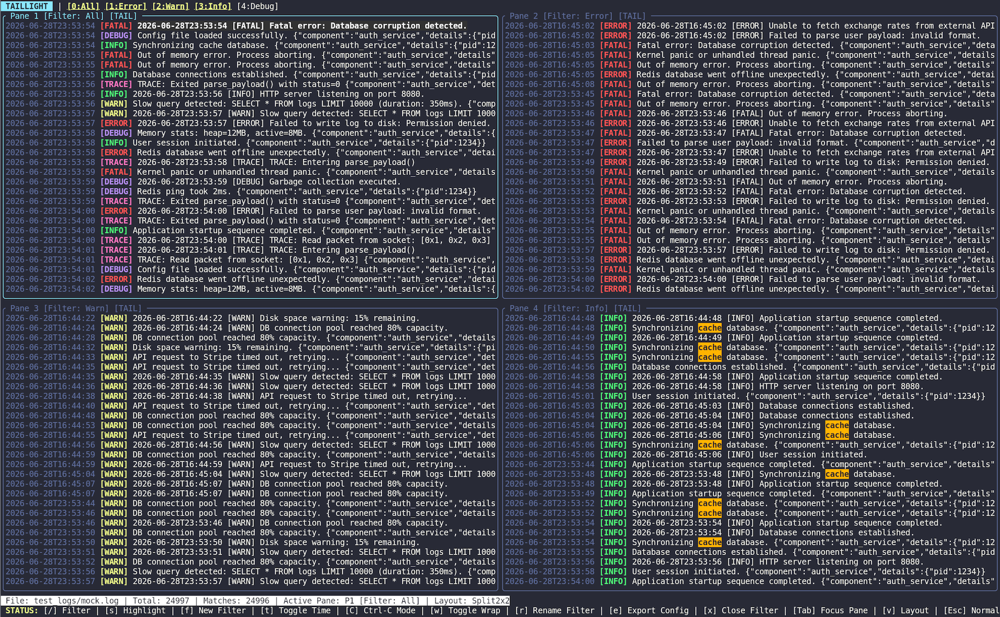

# Taillight (Real-Time Log Viewer)

`taillight` (you may alias as `tl`) is a fast, terminal-based log viewer written in Rust. It tail-indexes growing logs in real-time, performing lazy offsets parsing (JSON or plaintext), and renders them in top-bar tabs and tmux-like split layouts.

---

## Key Features

1. **Lazy Tail Indexing**: Background indexing of log file offsets keeps memory usage low and scrolling instantaneous, even on gigabyte-sized files.
2. **Tmux-like Split Layouts**: Split your viewport vertical, horizontal, or in a 2x2 grid to watch different filters simultaneously.
3. **Structured Log Parsing**: Automatically detects and parses JSON formatted logs (`level`, `message`, `time`) and standard plaintext log severities (`[INFO]`, `[ERROR]`, etc.).
4. **Real-time Filters**: Add (`f`), delete (`x`/`c`), or rename (`r`) filters on-the-fly. Filters filter background offsets in concurrent tasks, avoiding UI freeze.
5. **Interactive Highlight**: Highlight text patterns using regex (`s`) and jump between matching lines (`n`/`N`).
6. **Flexible Config Loading & Export**: Load settings automatically from local directory or user home config files, with interactive exports (`e`).

---

## Installation & Building

Make sure you have Rust and Cargo installed, then run:

```bash
cargo build --release
```

The compiled binary will be generated at `./target/release/taillight`. 

> [!TIP]
> You can create a shell alias `tl` to invoke `taillight` easily:
> ```bash
> alias tl="./target/release/taillight"
> ```

---

## Basic Usage

### 1. View a Log File
```bash
taillight path/to/app.log
```

### 2. Stream Stdin (Piped mode)
```bash
tail -f app.log | taillight
```

### 3. Load with Custom Layout
Override the default layout using the `-l` or `--layout` option (`single`, `vertical`, `horizontal`, `grid` / `split2x2`):
```bash
taillight app.log -l grid
```

### 4. Load with Specific Config Path
By default, `taillight` looks for `taillight_config.json` in the current working directory, then in home folders. You can pass a specific path using `-c` / `--config`:
```bash
taillight app.log -c custom_rules.json
```

### 5. Hide Timestamps on Startup
You can launch `taillight` with the `--no-timestamps` flag to hide parsed timestamps:
```bash
taillight app.log --no-timestamps
```

### 6. Control Ctrl-C Behavior (Piped Mode)
By default, pressing `Ctrl-C` kills both the writing process in the pipeline and exits `taillight`.
You can change this using `--ctrl-c-behavior` to only kill the writer process, allowing you to browse the captured logs in TUI:
```bash
# Keep taillight open after Ctrl-C stops the stream
some_generator | taillight --ctrl-c-behavior kill-writer
```

### 7. Enable Word Wrapping
You can start `taillight` with word wrapping enabled using `-w` or `--word-wrap` option:
```bash
taillight app.log -w
```

---

### 5. Case-Insensitivity Tips
* **Log Levels (Trace, Debug, Info, Warn, Error, Fatal):** `taillight`'s built-in log level classifier is completely case-insensitive by default. Values like `[info]`, `[Info]`, or `[INFO]` (as well as JSON level values like `"warning"`, `"Warn"`, etc.) are detected and filtered identically.
* **Regex Filters & Highlights (`/` and `s` keys):** Custom regular expression filters on tabs or highlight queries are case-sensitive by default. To perform case-insensitive keyword filtering or highlighting, prepend your regex with the **`(?i)`** modifier (e.g. `(?i)stripe` will match `stripe`, `Stripe`, or `STRIPE`).

---

## Interactive Hotkeys

When in **Normal Mode**:

| Key | Action |
|-----|--------|
| `q` | Quit the application cleanly |
| `?` / `H` | Show the quick help bar |
| `/` | Edit active filter's regex pattern |
| `s` | Set/edit regex highlight query for the active pane |
| `n` / `N` | Jump forward/backward to the next highlight match |
| `f` | Create a custom filter (prompts for Name and Regex filter) |
| `t` | Toggle time display (show/hide timestamps) on the fly |
| `C` | Toggle Ctrl-C behavior (Kill All & Exit / Kill Writer Only) on the fly |
| `w` | Toggle word wrapping (show wrapped lines) on the fly |
| `r` | Rename the current filter |
| `x` / `c` | Delete the current filter (except system default filters) |
| `e` | Export current view config (prompts for destination filename) |
| `v` | Cycle layout modes (Single, SplitVertical, SplitHorizontal, Split2x2) |
| `Tab` | Switch focus forward to the next pane |
| `Shift + Tab` | Switch focus backward to the previous pane |
| `h` / `l` or `←` / `→` | Cycle active filter index in the current pane |
| `j` / `k` or `↓` / `↑` | Scroll logs down/up by 1 line |
| `Ctrl + d` / `Ctrl + u` | Scroll logs down/up by half-screen |
| `g` / `G` | Jump to the very beginning / end of logs |
| `0` to `9` | Jump directly to filter index 0-9 in the active pane |
| `Esc` | Clear active prompts or return to Normal Mode |

For more details on setting up custom layouts and filter rules, see [config.md](file:///home/ucluser/gemini_playground/config.md).
